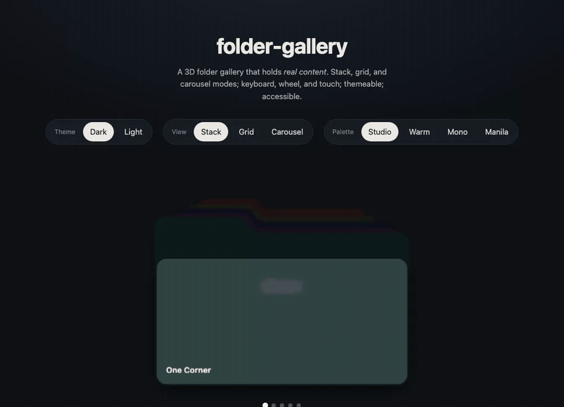
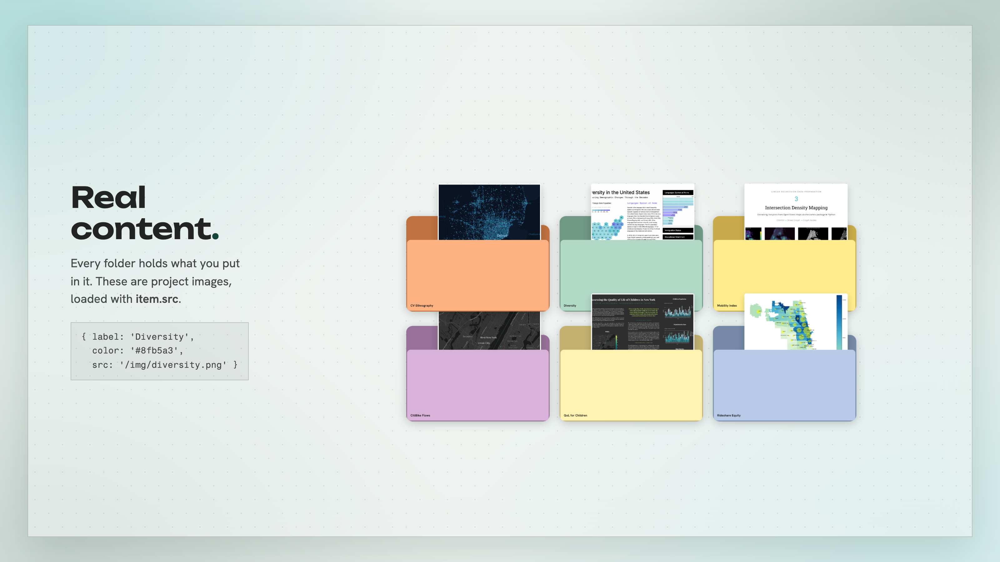
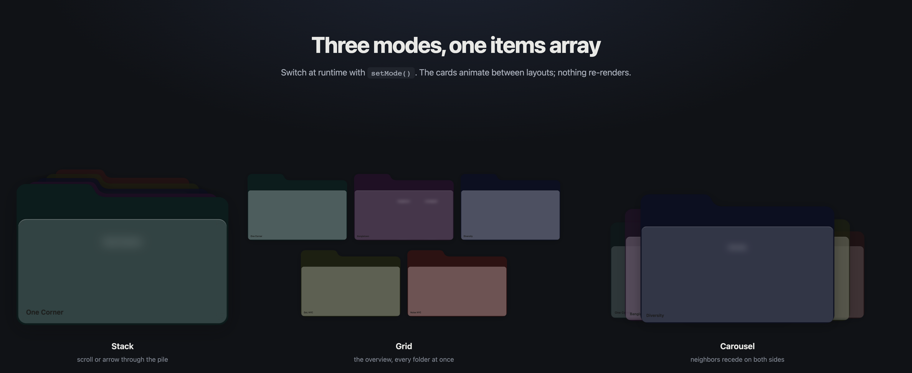
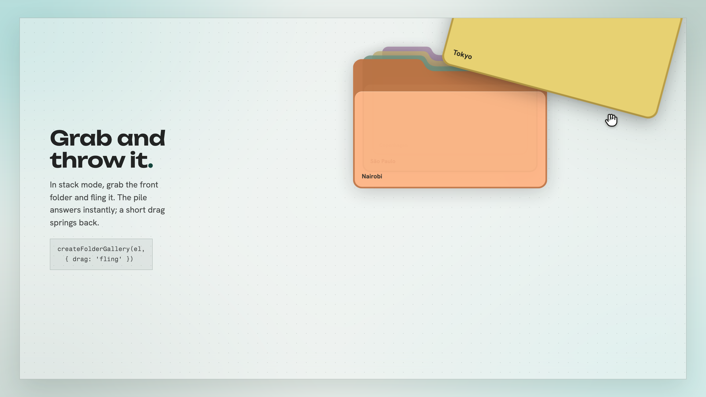
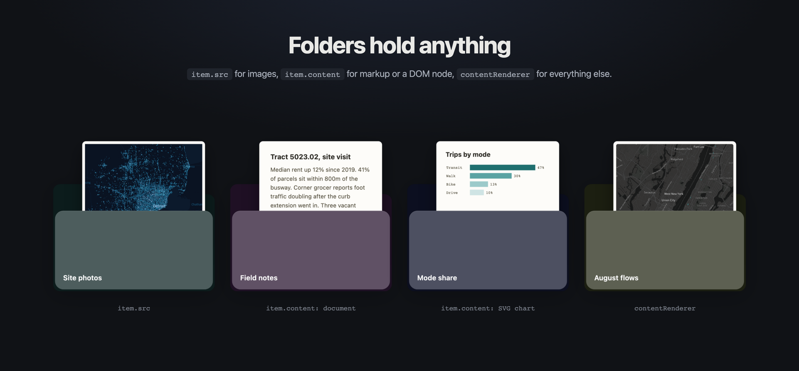
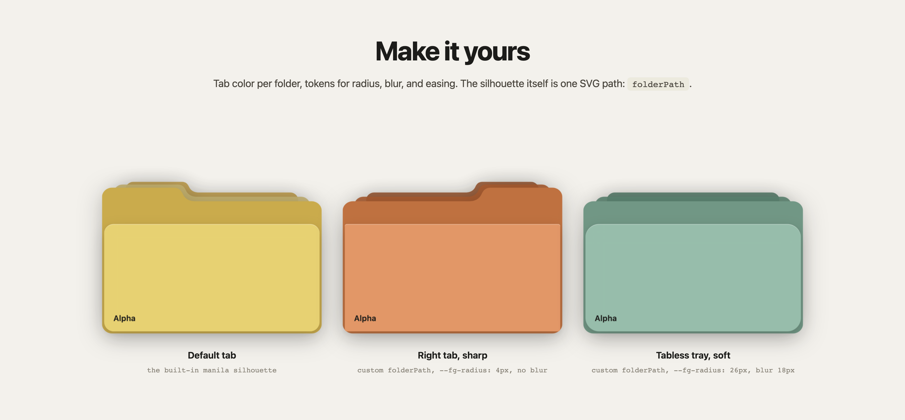

# flipfolio

[](https://www.npmjs.com/package/flipfolio)
[](https://bundlephobia.com/package/flipfolio)
[](https://github.com/kirthi-b/flipfolio/actions/workflows/ci.yml)
[](LICENSE)

A gallery where every item is a folder: stack them, grid them, spin them.

Started as a CSS 3D experiment; it now runs the [kirthi.studio](https://kirthi.studio) homepage. No framework, no dependencies.

Live demo: [kirthi.studio/demos/flipfolio](https://kirthi.studio/demos/flipfolio/), or edit it on [StackBlitz](https://stackblitz.com/github/kirthi-b/flipfolio/tree/master/examples/vanilla?file=main.js)

> v0.2.0. New this release: grab the active folder and throw it.



## Quick start
```sh
npm install flipfolio
```
```html
<link rel="stylesheet" href="flipfolio/styles.css">
<div id="gallery"></div>
<script type="module">
  import { createFolderGallery } from 'flipfolio';

  const gallery = createFolderGallery(document.getElementById('gallery'), {
    items: [
      { label: 'One Corner',   color: '#2a3a3a', src: '/img/one.jpg' },
      { label: 'Banglatown',   color: '#3d2e42', content: '<p>Any HTML or a DOM node.</p>' },
      { label: 'Diversity',    color: '#2a2d3e', src: '/img/three.jpg' },
    ],
    mode: 'stack',
    onSelect: (item, i) => console.log('selected', item.label, i),
  });

  // gallery.next() / .prev() / .goTo(2) / .setMode('carousel') / .destroy()
</script>
```

React:
```jsx
import { FolderGallery } from 'flipfolio/react';
import 'flipfolio/styles.css';

<FolderGallery items={items} mode="grid" onSelect={(item, i) => open(item)} />
```

Vue:
```vue
<script setup>
import { FolderGallery } from 'flipfolio/vue';
import 'flipfolio/styles.css';
</script>

<template>
  <FolderGallery :items="items" mode="grid" @select="(item, i) => open(item)" />
</template>
```

Web component:
```html
<script type="module">
  import { defineFolderGallery } from 'flipfolio/element';
  defineFolderGallery();
</script>
<folder-gallery mode="carousel"></folder-gallery>
<script>document.querySelector('folder-gallery').items = items;</script>
```

## What it looks like


Folders hold your actual content. These are live project images, loaded with `item.src`.


One items array, three layouts. `setMode()` animates between them at runtime.


Grab the front folder and throw it. Stack mode, `drag: 'fling'`; a short drag springs back.


Interiors take images, markup, DOM nodes, or a `contentRenderer` for anything else.


Per-folder tab colors, tokens for radius and blur, and the silhouette itself is one SVG path.

## API
`createFolderGallery(rootElement, options) -> handle`

| option | type | default | notes |
|---|---|---|---|
| `items` | `Item[]` | `[]` | `{ label?, color?, src?, content?, decal?, ...data }` |
| `mode` | `'stack'\|'grid'\|'carousel'` | `'stack'` | 3 modes (a 4th "shelf" is planned) |
| `grid` | `{ columns?, gap? }` | auto | pin the grid's column count and/or gap (px); default is a width/count heuristic |
| `peek` | `'hover'\|'always'\|'off'` | `'hover'` | contents slide out of the folder |
| `drag` | `'fling'\|'off'` | `'fling'` | grab the active folder and throw it (stack mode) |
| `contentRenderer` | `(card, item, i) => void` | built-in | fills the folder interior with whatever you render |
| `onSelect` | `(item, i) => void` | (none) | fired on click/Enter of the active folder (no built-in navigation) |
| `folderPath` | `string` | manila default | SVG path `d` (viewBox `0 0 480 342`), or a `FOLDER_PATHS` preset |
| `loop` | `boolean` | `true` | wrap-around |
| `scrollNav` | `boolean` | `true` | wheel/trackpad cycles the stack/carousel |
| `reducedMotion` | `'auto'\|'off'\|'force'` | `'auto'` | drops the 3D tilt when reduced |
| `defaultActiveIndex` | `number` | `0` | |
| `label` | `string` | `'Folder gallery'` | `aria-label` for the listbox |

Handle: `next()`, `prev()`, `goTo(i)`, `setMode(m)`, `setPeek(p)`, `setColor(i, hex)`, `setGradient(i, gradient)`, `getActiveIndex()`, `getMode()`, `getPeek()`, `getColor(i)`, `getGradient(i)`, `getItems()`, `destroy()`.

Events (CustomEvent on the root, bubbling): `fg-select`, `fg-activechange`, `fg-modechange`, `fg-peekchange` (detail `{ peek }`), `fg-flingstart` and `fg-flingend` (detail `{ index, direction }`, direction `'next' | 'prev'`), each with `event.detail`. React props: `onSelect`, `onActiveChange`, `onModeChange`, `onPeekChange`, `onFlingStart`, `onFlingEnd`. Vue emits: `@select`, `@active-change`, `@mode-change`, `@peek-change`, `@fling-start`, `@fling-end`.

## Content
Each folder renders what you give it: `item.src` for an image, `item.content` for an HTML string or a DOM node, or a `contentRenderer(card, item, index)` for anything richer. Set `item.decal` to an image URL and the photo prints on the folder's front panel; the back and tab keep their color. Contents slide out of the folder on hover; the `peek` option makes that always-on or turns it off.

## Silhouette
`folderPath` takes any SVG path `d` in the `0 0 480 342` viewBox. Three presets ship as `FOLDER_PATHS`: `left` (the default tab), `right` (tab mirrored), and `tray` (no tab). Pass one instead of a raw string:

```js
import { createFolderGallery, FOLDER_PATHS } from 'flipfolio';
createFolderGallery(el, { items, folderPath: FOLDER_PATHS.tray });
```

## Runtime theming
Each folder's palette derives from `item.color`; `setColor(index, hex)` re-derives the whole thing (SVG back, frosted + solid fronts, auto-contrast label) at runtime, no rebuild. `item.gradient` paints a CSS gradient across the front over the frosted surface, and `setGradient(index, gradient)` sets or clears it live (pass a falsy value to clear). Together they drive swatch pickers and theme switchers:

```js
gallery.setColor(0, '#3d2e42');                       // recolor one folder
gallery.setGradient(0, 'linear-gradient(135deg, #236363, #6FCDCD, #8B7FB8)');
gallery.setGradient(0, null);                          // back to the flat front
```

## Accessibility
`role="listbox"`/`option`, roving tabindex, arrow-key + Home/End navigation, `aria-live` position announcements, `:focus-visible` rings, and a `prefers-reduced-motion` fallback that drops the 3D tilt.

## Theming
Override the CSS custom properties on `.fg-root`: `--fg-folder-bg`, `--fg-radius`, `--fg-perspective`, `--fg-ease`, `--fg-front`, `--fg-front-solid`, `--fg-active-blur`, `--fg-label`, `--fg-dot`, `--fg-dot-active`, `--fg-scene-height`, `--fg-gap`, `--fg-folder-shadow`, `--fg-gradient-opacity`, `--fg-label-size`, `--fg-label-weight`, `--fg-label-tracking`. Light is the default; dark applies automatically under `prefers-color-scheme: dark`, and `data-fg-theme="light"` or `"dark"` on `.fg-root` overrides either way.

## Limits
Client-rendered only: folders paint after JS runs, there is no SSR of the layout itself. Every folder is a live 3D layer, so the sweet spot is 12 items or fewer, not hundreds. Uses `aspect-ratio` and `backdrop-filter`: evergreen browsers only, no IE fallback.

## License
MIT © Kirthi Balakrishnan
